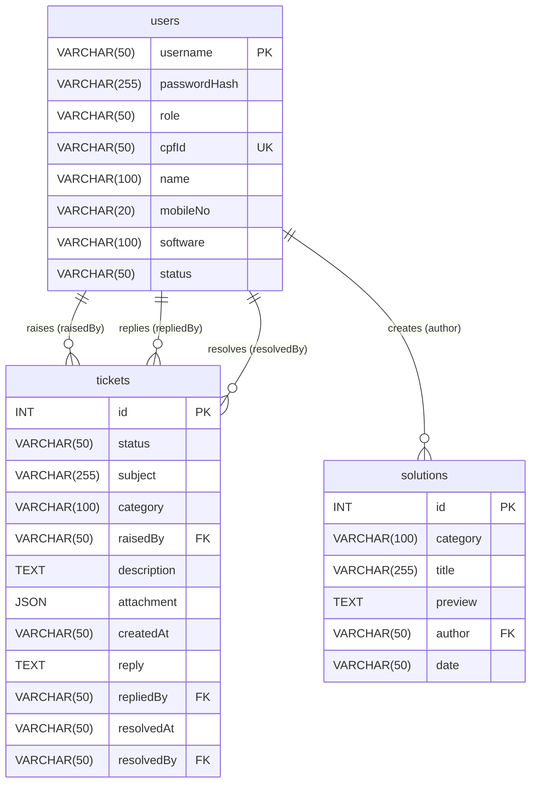

# ONGC Support Ticketing System - Database Design Documentation

This document describes the MySQL database design for the ONGC Support Ticketing System, which maps the JSON data structures (`users.json`, `tickets.json`, and `solutions.json`) into a relational database schema.

---

## Database Configuration

*   **Database Engine:** MySQL (InnoDB)
*   **Database Name:** `ongc`
*   **Database User:** `root` (Default administrative account)
*   **Database Password:** `root`
*   **Character Set:** `utf8mb4` (Unicode UTF-8, fully supports emojis, symbols, and multilingual text)
*   **Collation:** `utf8mb4_unicode_ci` (Case-insensitive comparison)

---

## Setup Instructions

To set up the database and seed it with the legacy JSON data, follow these steps:

### Option A: Using MySQL Command Line Interface (CLI)

1.  Open your terminal or command prompt.
2.  Log in to your local MySQL server as `root` (you will be prompted to enter the password `root`):
    ```bash
    mysql -u root -p
    ```
3.  Execute the schema file to create the `ongc` database and its tables:
    ```sql
    SOURCE c:/Vansh_codings/ongc-project/backend/database/schema.sql;
    ```
4.  Execute the seed file to populate the tables with the initial dataset:
    ```sql
    SOURCE c:/Vansh_codings/ongc-project/backend/database/seed.sql;
    ```

### Option B: Using an Administration Client (e.g. MySQL Workbench, DBeaver)

1.  Connect to your local MySQL server.
2.  Open [schema.sql](file:///c:/Vansh_codings/ongc-project/backend/database/schema.sql) in a SQL editor window and execute it.
3.  Open [seed.sql](file:///c:/Vansh_codings/ongc-project/backend/database/seed.sql) in a SQL editor window and execute it.

---

## Entity Relationship Diagram (ERD)

Below is the logical relationship between the tables:



---

## Data Dictionary

### Table 1: `users`
Stores user profile information, role assignments, and login credentials.

| Column Name    | SQL Data Type  | Nullable | Keys / Constraints | Default Value | Description |
| :------------- | :------------- | :------: | :----------------- | :------------ | :---------- |
| `username`     | `VARCHAR(50)`  |    NO    | Primary Key        | *None*        | Unique user identifier used for logging in. |
| `passwordHash` | `VARCHAR(255)` |    NO    |                    | *None*        | Bcrypt-encrypted password hash. |
| `role`         | `VARCHAR(50)`  |    NO    |                    | *None*        | Permissions level of the user (e.g. admin, user). |
| `cpfId`        | `VARCHAR(50)`  |    NO    | Unique Key         | *None*        | Unique employee identification number (CPF). |
| `name`         | `VARCHAR(100)` |    NO    |                    | *None*        | Display name of the user. |
| `mobileNo`     | `VARCHAR(20)`  |    NO    |                    | *None*        | User's mobile phone number. |
| `software`     | `VARCHAR(100)` |   YES    |                    | `NULL`        | Assigned or related software tool (e.g. LINUX, SCUBE). |
| `status`       | `VARCHAR(50)`  |   YES    |                    | `NULL`        | Determines if the user is allowed to log in. |

### Table 2: `tickets`
Stores support tickets and tracks resolving progress, replies.

| Column Name   | SQL Data Type  | Nullable | Keys / Constraints               | Default Value | Description |
| :------------ | :------------- | :------: | :------------------------------- | :------------ | :---------- |
| `id`          | `INT`          |    NO    | Primary Key, Auto Increment      | *None*        | Unique identifier for each ticket. |
| `status`      | `VARCHAR(50)`  |    NO    | Index                            | *None*        | Current ticket lifecycle status. |
| `subject`     | `VARCHAR(255)` |    NO    |                                  | *None*        | Brief subject summary. |
| `category`    | `VARCHAR(100)` |    NO    | Index                            | *None*        | Relevant system/software category. |
| `raisedBy`    | `VARCHAR(50)`  |    NO    | Foreign Key -> `users.username`  | *None*        | User who created the ticket. |
| `description` | `TEXT`         |   YES    |                                  | `NULL`        | Rich-text description of the issue. |
| `attachment`  | `JSON`         |   YES    |                                  | `NULL`        | File upload info containing name and url. |
| `createdAt`   | `VARCHAR(50)`  |    NO    |                                  | *None*        | Date when the ticket was created. |
| `reply`       | `TEXT`         |   YES    |                                  | `NULL`        | Resolution reply message text. |
| `repliedBy`   | `VARCHAR(50)`  |   YES    | Foreign Key -> `users.username`  | `NULL`        | Admin user who wrote the reply. |
| `resolvedAt`  | `VARCHAR(50)`  |   YES    |                                  | `NULL`        | Date when the ticket was resolved. |
| `resolvedBy`  | `VARCHAR(50)`  |   YES    | Foreign Key -> `users.username`  | `NULL`        | Admin user who resolved the ticket. |

### Table 3: `solutions`
Stores knowledge base articles written by administrative users.

| Column Name | SQL Data Type  | Nullable | Keys / Constraints              | Default Value | Description |
| :---------- | :------------- | :------: | :------------------------------ | :------------ | :---------- |
| `id`        | `INT`          |    NO    | Primary Key, Auto Increment     | *None*        | Unique identifier for each article. |
| `category`  | `VARCHAR(100)` |    NO    | Index                           | *None*        | Solution's software/domain category. |
| `title`     | `VARCHAR(255)` |    NO    |                                 | *None*        | Descriptive title of the solution. |
| `preview`   | `TEXT`         |    NO    |                                 | *None*        | Step-by-step troubleshooting steps. |
| `author`    | `VARCHAR(50)`  |    NO    | Foreign Key -> `users.username` | *None*        | Admin username who published this solution. |
| `date`      | `VARCHAR(50)`  |    NO    |                                 | *None*        | Date published/created. |

---

## Future Connection and Integration Outline

Although the application currently reads and writes to local JSON files using `fs.readFileSync` and `fs.writeFileSync`, migrating to the MySQL database requires these steps:

1.  **Dependency Installation**:
    Add the `mysql2` driver and an ORM (like Sequelize or Prisma) or raw SQL query builder (like `knex`):
    ```bash
    npm install mysql2 dotenv
    ```
2.  **Environment Configuration**:
    Create a `.env` file in the backend folder:
    ```env
    DB_HOST=localhost
    DB_USER=root
    DB_PASSWORD=root
    DB_NAME=ongc
    PORT=5000
    ```
3.  **Connection Setup**:
    Initialize a connection pool in `backend/config/db.js`:
    ```javascript
    const mysql = require('mysql2/promise');
    require('dotenv').config();

    const pool = mysql.createPool({
        host: process.env.DB_HOST,
        user: process.env.DB_USER,
        password: process.env.DB_PASSWORD,
        database: process.env.DB_NAME,
        waitForConnections: true,
        connectionLimit: 10,
        queueLimit: 0
    });

    module.exports = pool;
    ```
4.  **Refactoring Routes**:
    Replace synchronous filesystem access with database queries. For instance, in `authRoutes.js`:
    ```javascript
    // BEFORE:
    // const users = JSON.parse(fs.readFileSync(usersPath));
    // const user = users.find(u => u.username === username);

    // AFTER:
    const [rows] = await pool.query('SELECT * FROM users WHERE username = ?', [username]);
    const user = rows[0];
    ```
